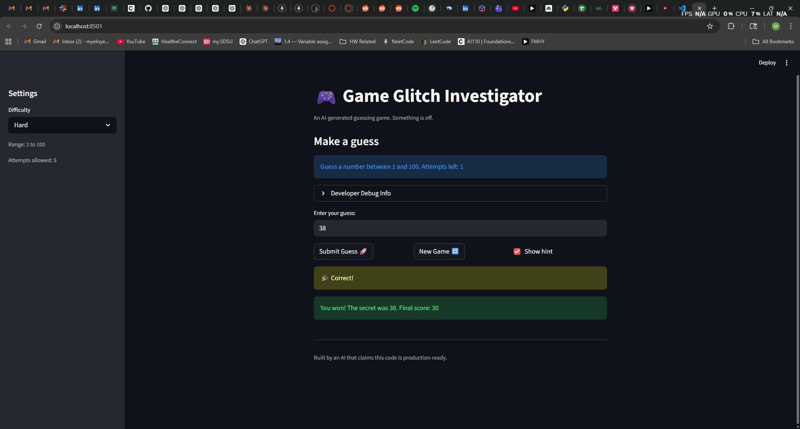

# 🎮 Game Glitch Investigator: The Impossible Guesser

## 🚨 The Situation

You asked an AI to build a simple "Number Guessing Game" using Streamlit.
It wrote the code, ran away, and now the game is unplayable.

- You can't win.
- The hints lie to you.
- The secret number seems to have commitment issues.

## 🛠️ Setup

1. Install dependencies: `pip install -r requirements.txt`
2. Run the broken app: `python -m streamlit run app.py`

## 🕵️‍♂️ Your Mission

1. **Play the game.** Open the "Developer Debug Info" tab in the app to see the secret number. Try to win.
2. **Find the State Bug.** Why does the secret number change every time you click "Submit"? Ask ChatGPT: _"How do I keep a variable from resetting in Streamlit when I click a button?"_
3. **Fix the Logic.** The hints ("Higher/Lower") are wrong. Fix them.
4. **Refactor & Test.** - Move the logic into `logic_utils.py`.
   - Run `pytest` in your terminal.
   - Keep fixing until all tests pass!

## 📝 Document Your Experience

- [ ] Game purpose:
  - A number guessing game where the player tries to guees a secret number within limited number of attempts.
- [ ] Bugs found:
  - Hint messages were swapped — "Too High" said "Go HIGHER!" and "Too Low" said "Go LOWER!".
  - On even-numbered attempts, the secret number was cast to a string, making correct guesses impossible.
  - Attempts counter started at 1 instead of 0, giving the player one fewer guess than shown.
  - "New Game" button used a hardcoded range of 1–100 regardless of selected difficulty.
  - "New Game" button did not reset the guess history.
  - Normal and Hard difficulty ranges were swapped
- [ ] Fixes applied:
  - Corrected hint messages in `check_guess()` so direction matches the guess result.
  - Removed the type-cast on even attempts so comparisons are always int-to-int.
  - Initialized `attempts` to `0` so the displayed count is accurate.
  - Updated "New Game" to use the difficulty-based `low`/`high` range.
  - Added `st.session_state.history = []` on new game reset.
  - Swapped the ranges for Normal (1–50) and Hard (1–100) in `get_range_for_difficulty()`

## 📸 Demo

- [ ] []

## 🚀 Stretch Features

- [ ] [If you choose to complete Challenge 4, insert a screenshot of your Enhanced Game UI here]
